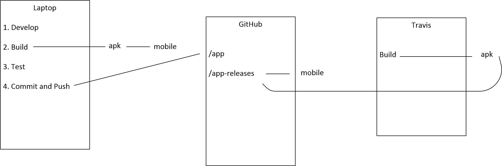

BUILD AN IONIC2 PROJECT USING TRAVIS
====================================

- Overview

- Using bare bones ionic2 app.

Create local project
--------------------

- Create bare bones Ionic2 app.

- **Show structure of .travis file.**
  
  Contains:
  
           language: java

Usual build cycle
-----------------

	npm install
	cordova platform add android
	ionic serve
	ionic build android

- **Show apk file.**

	platforms/android/build/outputs/apk

Create repository on github
---------------------------

- URL:

        https://github.com/sarbjitbilling-stw/testci.git

- Create repository on github.

- Only source code is pushed.

        git init
        git add .
        git commit -m wip
        git remote add origin https://github.com/sarbjitbilling-stw/testci.git
        git push origin master
        git branch --set-upstream-to origin/master
        git push

- My app in github with travis file (.yml)

Github config
-------------

- Get a github token for deployment to github pages:

        click in profile picture -> Settings
        click on Personal access tokens
        enter description
        give repo access
        click Generate token

Travis config
-------------

- URL:

        https://travis-ci.org
        
- Authorize travis to access github.

- Synch travis with github repositories.

- Enable the new project in travis web.

- Set github token on travis project:
        
        click on More options -> Settings
        create  GITHUB_TOKEN variable value in Environment Variables section

Travis workflow
---------------

- Do a dummy commit.
  **See build kicked off in travis web.**
  Takes a long time to build, appoximately 10 minutes.
  Final build at:
   
        /home/travis/build/sarbjitbilling-stw/testci/platforms/android/build/outputs/apk/android-debug.apk

- deploy.sh pushes to gh-pages.

- Access artifact via:

        https://sarbjitbilling-stw.github.io/testci/platforms/android/build/outputs/apk/android-debug.apk

- **Show email received**

================================================================================

TODOS
-----
- Fix deployment to GitHub

- **iOS version**

- Save to Artifactory/Nexus?

- Unit tests

- Tech stack upgrade
  Iconic 3/Angular 4

- Branching strategy

- Distribution email

